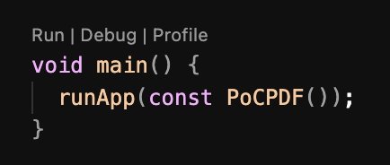
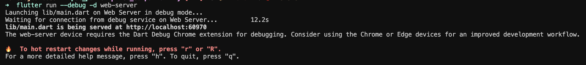

# PoC PDF

Projeto criado exclusivamente para teste de criação de PDFs.

Plataformas testadas:

- [x] Android
- [x] Web
- [] Windows

## Inicialização

### Instalar as dependências

```
$ flutter pub get
```

### Executar o projeto

#### Caso esteja executando fora do Visual Studio Code

```
$ flutter devices
```

Esse comando retorna todos os dispositivos conectados e compatíveis com projetos Flutter.

O retorno possui a estrutura:

`device_name • device_code • device_arch • device_os_version`

Exemplo:

`macOS (desktop) • macos • darwin-arm64 • macOS 14.6.1 23G93 darwin-arm64`

#### Caso esteja executando dentro do Visual Studio Code

Instale a extensão [Flutter](https://marketplace.visualstudio.com/items?itemName=Dart-Code.flutter) e a habilite.

Com a extensão habilitada, no canto inferior direito do VS Code aparecerá um botão com o dispositivo selecionado para execução do projeto. Conforme o print abaixo.


Caso não seja o dispositivo que deseja executar o projeto, basta clicar nele que aparecerá na barra de comandos do VS Code, no meio superior, todos os dispositivos reconhecidos conectados à sua máquina pela extensão do Flutter.

Após instalada a extensão, no arquivo [main.dart](lib/main.dart), na função `void main()`, você encontrará as ações como no print abaixo. Clique em **Debug**



#### Caso deseje executar a versão web do projeto

O Flutter é compatível (a nível de debug) com o Chrome e seus derivados (baseados em Chromium), mas em alguns casos esses derivados não são reconhecidos pela extensão do Flutter no VS Code e nem pelo comando `flutter devices`. Caso isso aconteça com você, a forma de executar o projeto é executando o comando:

```
flutter run --debug -d web-server
```

Esse comando inicia a versão web do projeto independente do navegador, instanciando-a em uma porta aberta da máquina.

Exemplo de resposta:



## Explicando o código

Para ser possível exportar arquivos PDF nessa PoC foram necessárias 3 dependências:

- [open_file](https://pub.dev/packages/open_file)
    - Para abrir o arquivo criado
- [path_provider](https://pub.dev/packages/path_provider)
    - Para obter uma pasta secura dentro do dispositivo
- [pdf](https://pub.dev/packages/pdf)
    - Para criar e salvar o PDF
- [permission_handler](https://pub.dev/packages/permission_handler)
    - Para gerenciar a permissão de armazenamento de arquivos no dispositivo
- [web](https://pub.dev/packages/web)
    - Para executar funções específicas para a versão web

#### permission_handler

Essa dependência é bem simples de utilizar e sua própria documentação já é suficiente.

No código, ela foi utilizada no arquivo [AndroidManifest.xml](android/app/src/main/AndroidManifest.xml) para anotar as dependências de armazenamento necessárias no Android e no arquivo [home_page.dart](lib/home_page.dart) para fazer a solicitação de permissão ao usuário.

#### pdf, path_provider, open_file e universal_web

A criação de PDF no Flutter também é bem simples, tudo que precisamos saber está no arquivo [prepare_pdf.dart](lib/prepare_pdf.dart).

Nele carregamos os assets necessários e configuramos a página do jeito que queremos.

Percebe-se que a montagem do PDF em si é feita na mesma estutura que Widgets no Flutter, facilitando o entendimento e personalização.

Na versão Android, usamos o `open_file` para exibir o PDF criado, já na versão Web, utilizamos o pacote `universal_web` para fazer o download do PDF criado.
